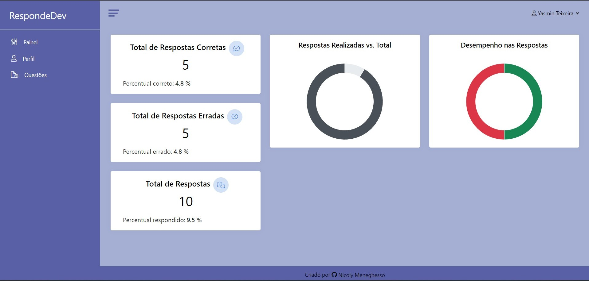
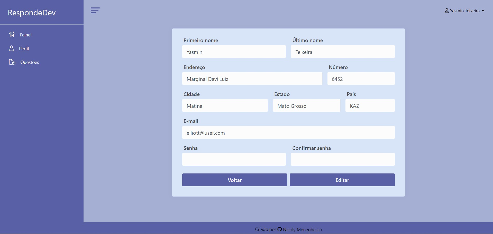
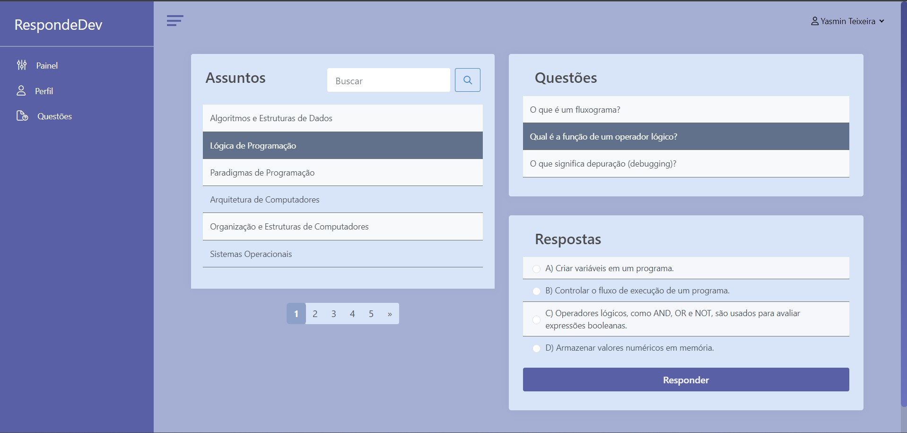
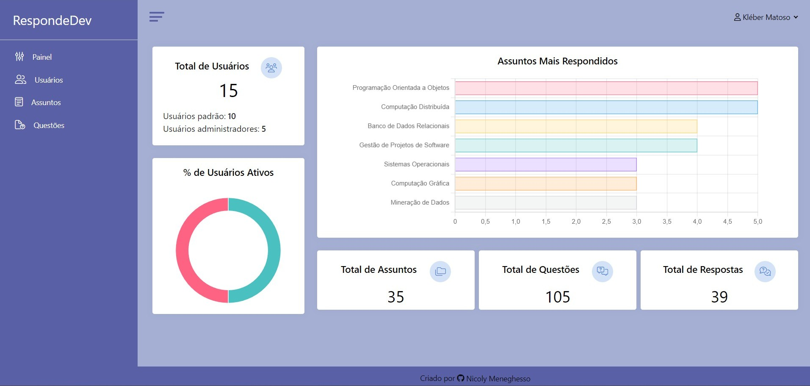
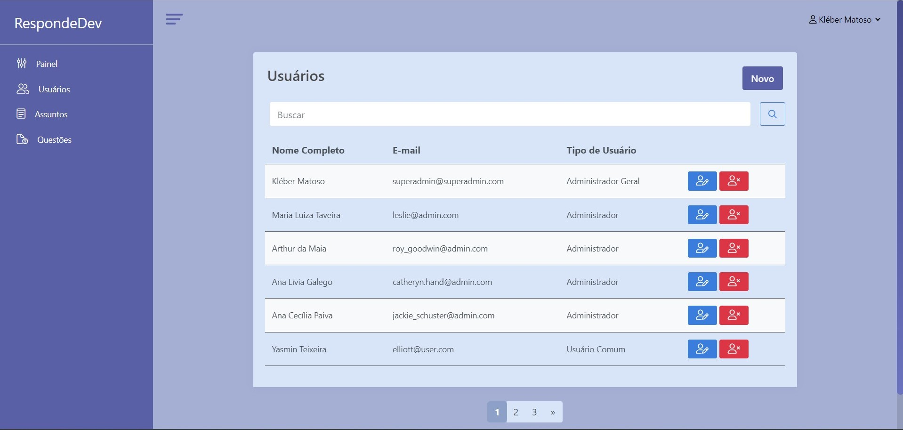
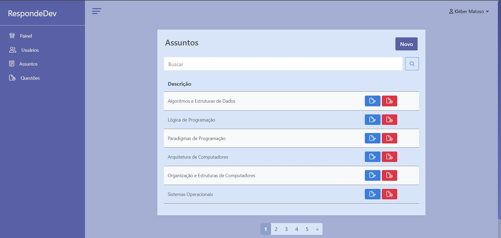
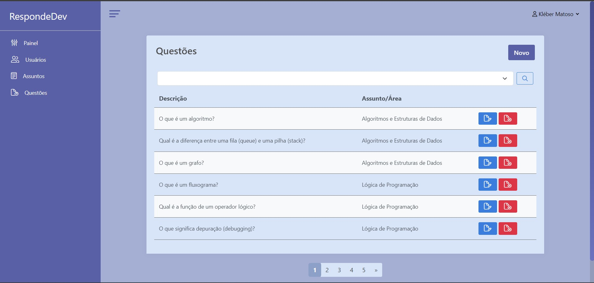

# Projeto de Perguntas e Respostas

Este projeto foi desenvolvido para consolidar meus conhecimentos em Ruby on Rails, criando uma plataforma completa de perguntas e respostas com cadastro e gerenciamento de usuários, assuntos, questões e respostas, além de dashboards com gráficos interativos.

## 🚀 Tecnologias Utilizadas
* Ruby on Rails
* Devise (ferramenta de autenticação)
* SQLite
* JavaScript
* HTML, CSS & Bootstrap 

## ⚙️ Funcionalidades
* Autenticação completa com Devise (login, logout, cadastro e recuperação de senha)
* CRUD completo para usuários, assuntos, questões e respostas
* Controle de permissões com dois perfis de usuário:
  * Usuário: responder perguntas e acompanhar desempenho em gráficos
  * Administrador: gerenciar todo o conteúdo e visualizar métricas gerais
* Dashboards interativos em JS:
  * Desempenho individual (respostas corretas, incorretas e total respondido)
  * Painel administrativo com estatísticas globais

## Pré-visualização

