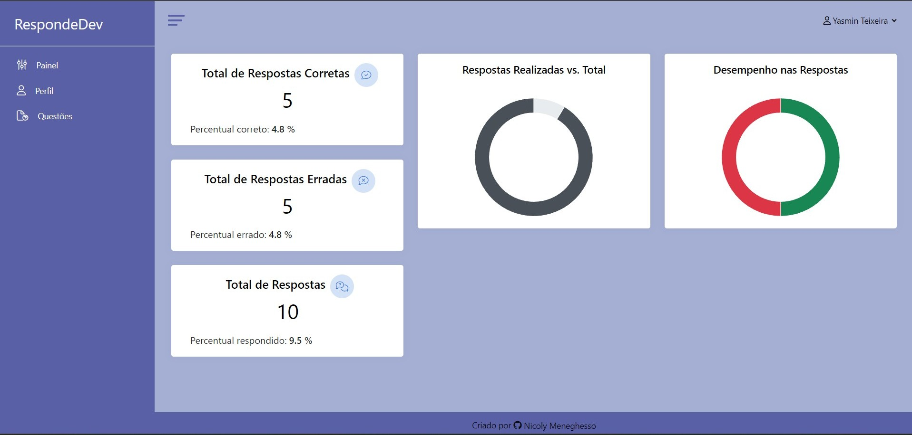
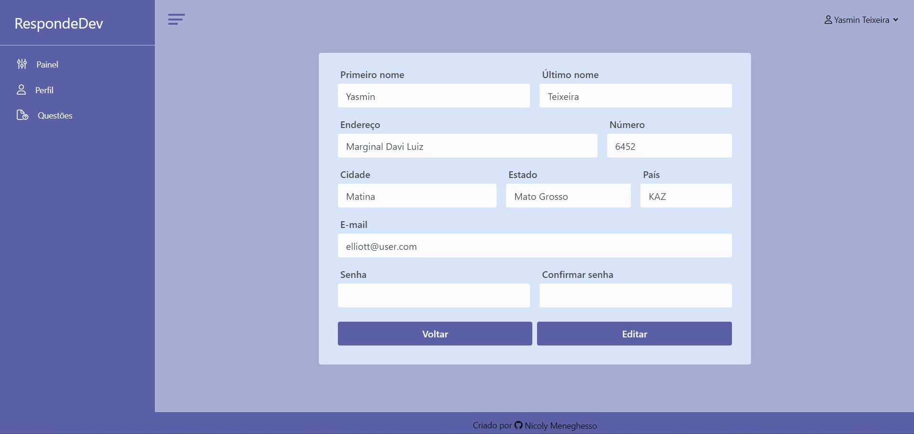
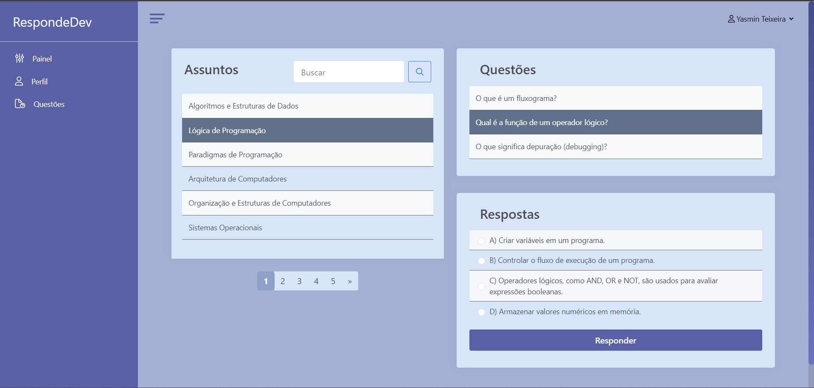
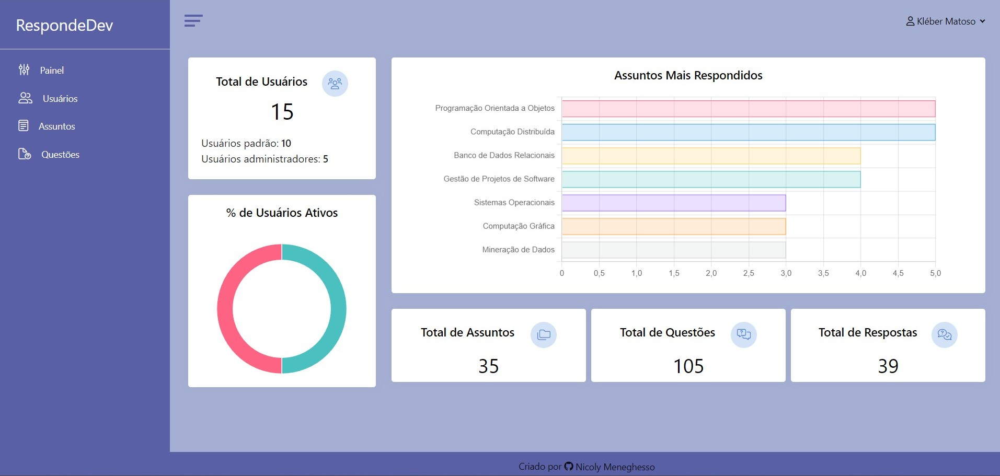
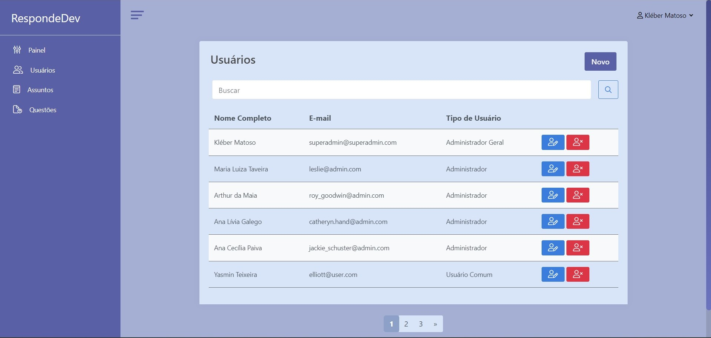
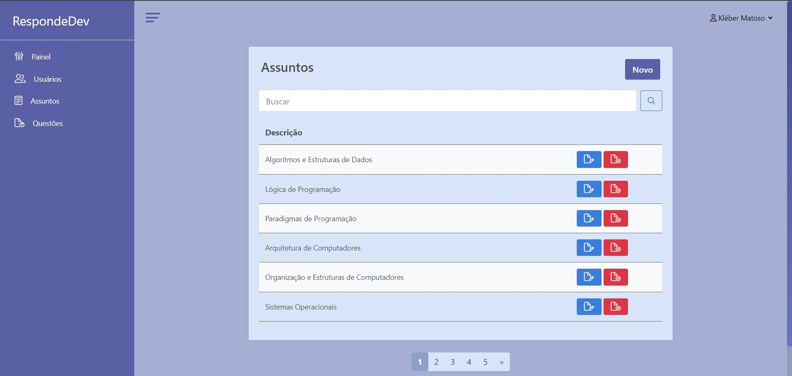
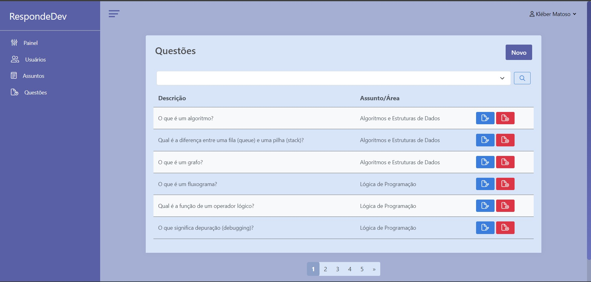

# 🎯 Ask Rails - Plataforma de Perguntas e Respostas

=======
Uma aplicação robusta e bem estruturada para gestão de conhecimento colaborativo, desenvolvida em **Ruby on Rails 8.0** com foco em usabilidade, escalabilidade e boas práticas de desenvolvimento.
>>>>>>> c8d9bff (Ajuste README)

=======
## 📋 Sumário
>>>>>>> c8d9bff (Ajuste README)

- [Visão Geral](#visão-geral)
- [Demonstração](#demonstração)
- [Funcionalidades](#funcionalidades)
- [Tecnologias Utilizadas](#tecnologias-utilizadas)
- [Arquitetura e Estrutura do Projeto](#arquitetura-e-estrutura-do-projeto)
- [Instalação e Configuração](#instalação-e-configuração)
- [Como Executar](#como-executar)
- [Boas Práticas Implementadas](#boas-práticas-implementadas)
- [Melhorias Futuras](#melhorias-futuras)
- [Contato](#contato)

---

## 🎯 Visão Geral

**Ask Rails** é uma plataforma educacional que resolve o problema de organização centralizada de conhecimento em equipes e instituições de ensino. O sistema permite que usuários respondam questões catalogadas por assuntos, acompanhem seu desempenho através de dashboards interativos e que administradores gerenciem toda a base de conhecimento.

### Problema Resolvido
- ❌ Falta de centralização de perguntas e respostas
- ❌ Impossibilidade de rastrear desempenho individual
- ❌ Ausência de análise de métricas educacionais
- ❌ Gestão manual e desorganizada de conteúdo

### Solução Proposta
✅ Plataforma integrada com autenticação segura, controle granular de permissões, dashboards analíticos e interface intuitiva.

---

## 🎬 Demonstração

| Home do Usuário | Perfil do Usuário |
|---|---|
|  |  |

| Respondendo Questões | Dashboard Admin |
|---|---|
|  |  |

| Gerenciar Usuários | Gerenciar Assuntos | Gerenciar Questões |
|---|---|---|
|  |  |  |

---

## ✨ Funcionalidades

### 👤 Para Usuários Regulares
- ✅ **Autenticação segura** - Cadastro, login, logout e recuperação de senha integrada com Devise
- ✅ **Responder questões** - Interface intuitiva separada por assuntos
- ✅ **Dashboard pessoal** - Visualização em tempo real de:
  - Total de questões respondidas
  - Respostas corretas e incorretas
  - Taxa de acerto por assunto
  - Gráficos interativos para acompanhamento
- ✅ **Perfil completo** - Atualização de dados pessoais e endereço
- ✅ **Suporte multi-idioma** - Interface disponível em português e inglês

### 👨‍💼 Para Administradores
- ✅ **Gerenciamento de usuários** - CRUD completo com busca avançada
- ✅ **Gerenciamento de assuntos** - Criação e edição de categorias
- ✅ **Gerenciamento de questões** - Criação com múltiplas respostas (nested attributes)
- ✅ **Dashboard administrativo** - Métricas globais com:
  - Usuários mais ativos
  - Assuntos mais estudados
  - Estatísticas gerais da plataforma
- ✅ **Paginação eficiente** - Navegação entre grandes volumes de dados

### 🔐 Sistema de Permissões
- **Regular User**: Pode responder questões e visualizar seu desempenho
- **Admin User**: Acesso completo ao painel administrativo
- **Super Admin**: Gerenciamento técnico da plataforma

---

## 🛠 Tecnologias Utilizadas

### Backend
| Tecnologia | Versão | Propósito |
|---|---|---|
| **Ruby** | 3.3.0 | Linguagem de programação |
| **Ruby on Rails** | 8.0.1 | Framework web |
| **SQLite** | 2.1+ | Banco de dados relacional |
| **Puma** | 5.0+ | Servidor web |

### Frontend & Assets
| Tecnologia | Propósito |
|---|---|
| **Hotwire (Turbo)** | Navegação SPA-like sem JavaScript boilerplate |
| **Stimulus.js** | Framework JavaScript moderno e minimalista |
| **Bootstrap** | Framework CSS para design responsivo |
| **Propshaft** | Asset pipeline moderno |
| **Importmap Rails** | Gerenciamento de módulos ES com import maps |

### Gems Principais
```ruby
devise          # Autenticação de usuários
kaminari        # Paginação elegante
rails-i18n      # Internacionalização (i18n)
tty-spinner     # CLI spinners para feedback visual
faker           # Seeds realistas com dados fake
brakeman        # Scanner de vulnerabilidades de segurança
rubocop         # Linter e formatter de código
```

### Infraestrutura & Deploy
| Ferramenta | Propósito |
|---|---|
| **Docker** | Containerização da aplicação |
| **Kamal** | Deploy simplificado em produção |
| **Solid Cache** | Cache backend com banco de dados |
| **Solid Queue** | Fila de jobs integrada |
| **Solid Cable** | WebSockets com banco de dados |

---

## 🏗 Arquitetura e Estrutura do Projeto

### Estrutura de Diretórios

```
ask-rails/
├── app/
│   ├── controllers/          # Lógica de requisição HTTP
│   │   ├── api/             # API JSON endpoints
│   │   ├── panel/           # Painel administrativo
│   │   ├── site/            # Página pública
│   │   ├── users/           # Controllers de usuários
│   │   └── concerns/        # Comportamentos compartilhados
│   ├── models/              # Camada de dados e lógica de negócio
│   │   ├── user.rb
│   │   ├── question.rb
│   │   ├── subject.rb
│   │   ├── answer.rb
│   │   ├── user_question_answer.rb
│   │   ├── user_statistic.rb
│   │   └── concerns/        # Mixins e comportamentos reutilizáveis
│   ├── views/               # Templates ERB
│   ├── helpers/             # Métodos auxiliares para views
│   ├── javascript/          # Código JavaScript modular
│   │   ├── controllers/     # Stimulus controllers
│   │   └── panel/           # JavaScript do painel admin
│   ├── assets/              # Imagens, stylesheets
│   └── mailers/             # Templates de e-mail
├── config/
│   ├── routes.rb            # Definição de rotas
│   ├── database.yml         # Configuração do banco
│   ├── devise.rb            # Configuração Devise
│   └── environments/        # Configs por ambiente
├── db/
│   ├── migrate/             # Migrações do banco de dados
│   └── seeds.rb             # Seeds para dados iniciais
├── lib/                     # Código customizado
├── config.ru                # Rack configuration
├── Dockerfile               # Container Docker
└── Gemfile                  # Dependências Ruby
```

### Diagrama de Relações entre Modelos

```
User
  ├── has_many :user_question_answers
  └── has_many :user_statistics

Subject
  └── has_many :questions

Question
  ├── belongs_to :subject
  ├── has_many :answers
  └── has_many :user_question_answers

Answer
  └── belongs_to :question

UserQuestionAnswer (Join Table)
  ├── belongs_to :user
  └── belongs_to :question
```

### Padrões Arquiteturais Implementados

1. **MVC (Model-View-Controller)** - Separação clara de responsabilidades
2. **RESTful API** - Endpoints seguindo convenções REST
3. **Nested Routes** - Organização hierárquica de rotas
4. **Concern Modules** - Reutilização de comportamentos em controladores
5. **Enum Type Mapping** - Mapeamento seguro de tipos de usuário
6. **Dependent Destroy** - Integridade referencial automática
7. **Associations & Validations** - ORM robusto com validações em nível de modelo

---

## 🚀 Instalação e Configuração

### Pré-requisitos
- **Ruby 3.3.0** ou superior
- **Bundler** para gerenciar gems
- **Node.js 18+** (para gerenciar assets)
- **Git** para clonar o repositório
- **SQLite3** (geralmente incluído no sistema)

### Verificar Requisitos
```bash
# Verificar Ruby
ruby --version

# Verificar Node.js
node --version

# Verificar Bundler
bundle --version
```

### 📥 Passo 1: Clonar o Repositório
```bash
git clone https://github.com/seu-usuario/ask-rails.git
cd ask-rails
```

### 📦 Passo 2: Instalar Dependências
```bash
# Instalar gems Ruby
bundle install

# Instalar dependências JavaScript
yarn install  # ou npm install
```

### ⚙️ Passo 3: Configurar o Banco de Dados
```bash
# Executar as migrações
rails db:create
rails db:migrate

# (Opcional) Carregar dados de exemplo
rails db:seed
```

### 🔐 Passo 4: Gerar Chave de Criptografia (se necessário)
```bash
# Rails 8+ gera automaticamente se não existir
RAILS_ENV=development rails credentials:edit
```

### 🏃 Passo 5: Executar o Servidor
```bash
# Iniciar servidor de desenvolvimento
./bin/dev

# A aplicação estará disponível em http://localhost:3000
```

### 🐳 Alternativa: Executar com Docker
```bash
# Build da imagem
docker build -t ask-rails .

# Rodar container
docker run -d -p 3000:3000 --name ask-rails ask-rails
```

---

## 📝 Como Usar

### Criar Primeiro Usuário Admin (modo seed)
Após executar `rails db:seed`, você terá:
- **Usuário Admin**: Use as credenciais fornecidas no arquivo `db/seeds.rb`
- **Questões de Exemplo**: Algumas questões pré-carregadas para teste

### Login na Aplicação
1. Acesse `http://localhost:3000`
2. Clique em "Entrar"
3. Use suas credenciais registradas

### Acessar Dashboard do Admin
1. Faça login com uma conta Admin
2. Navegue para `/panel/admin`
3. Gerencie usuários, assuntos e questões

### Responder Questões (Usuário Regular)
1. Faça login com uma conta regular
2. Acesse a seção de questões
3. Selecione um assunto e comece a responder

---

## ✅ Boas Práticas Implementadas

### 1. **Segurança**
- ✅ Autenticação robusta com Devise (bcrypt)
- ✅ CSRF protection habilitado por padrão
- ✅ Input validation em modelos e controllers
- ✅ SQL injection prevention (ActiveRecord)
- ✅ Scanner de vulnerabilidades com Brakeman

### 2. **Organização de Código**
- ✅ Controllers lean com lógica mínima (fat models, slim controllers)
- ✅ Uso de concerns para comportamentos reutilizáveis
- ✅ Helpers bem estruturados para lógica de view
- ✅ Validações centralizadas nos modelos

### 3. **Performance**
- ✅ Paginação com Kaminari para limitar resultados
- ✅ Asset pipeline otimizado com Propshaft
- ✅ Hotwire para navegação assíncrona eficiente
- ✅ Cache com Solid Cache para dados frequentes

### 4. **Internacionalização (i18n)**
- ✅ Suporte multi-idioma (PT-BR e EN)
- ✅ Enums mapeados com traduções
- ✅ Gems rails-i18n para localização de data/hora

### 5. **Qualidade de Código**
- ✅ RuboCop para linting e padronização
- ✅ Migrations versionadas e reversíveis
- ✅ Seeds com Faker para dados realistas
- ✅ Estrutura de modelos com associações claras

### 6. **Responsividade**
- ✅ Design mobile-first com Bootstrap
- ✅ Componentes acessíveis
- ✅ Suporte a múltiplas resoluções

---

## 📚 Recursos Úteis

- [Rails Guides](https://guides.rubyonrails.org) - Documentação oficial
- [Devise Wiki](https://github.com/heartcombo/devise/wiki) - Autenticação
- [Stimulus JS](https://stimulus.hotwired.dev) - Framework JavaScript
- [Bootstrap Docs](https://getbootstrap.com/docs) - Design components
- [Rails Best Practices](https://rails-bestpractices.com) - Padrões recomendados

---

## 🤝 Como Contribuir

Sugestões de melhorias são bem-vindas! Para contribuir:

1. Faça um fork do projeto
2. Crie uma branch para sua feature (`git checkout -b feature/AmazingFeature`)
3. Commit suas mudanças (`git commit -m 'Add some AmazingFeature'`)
4. Push para a branch (`git push origin feature/AmazingFeature`)
5. Abra um Pull Request

---

## 🎓 Contexto Educacional

Este projeto foi desenvolvido como trabalho final para consolidar conhecimentos em **Ruby on Rails**, abrangendo:

- ✅ Autenticação e autorização
- ✅ CRUD completo com validações
- ✅ Relacionamentos complexos entre modelos
- ✅ Construção de dashboards com dados agregados
- ✅ Internacionalização
- ✅ Boas práticas de desenvolvimento
- ✅ Deploy e containerização

**Versão**: 1.0.0  
**Última Atualização**: Abril de 2026

---

**⭐ Se este projeto foi útil para você, considere deixar uma estrela!**